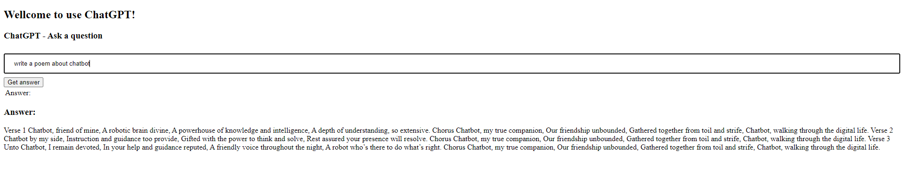

# IDS721-Projects

This repo records all projects and progress did in IDS721 at Duke

## Goals checklist
- [x] build flask framework
- [x] have Makefile, requirements.txt, and makefile.yml for github Actions CI
- [x] Create a Microservice in Flask API to generate images with ACGAN
- [ ] Optimize page rendering
- [ ] Configure Build System to Deploy changes
- [ ] Deploy on AWS App Runner

## examples

